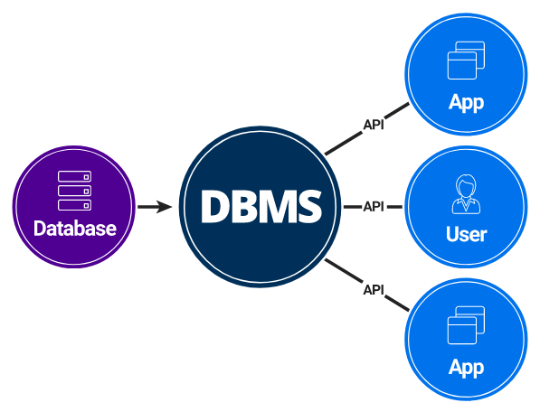

## ✔ Data Base

 

데이터 베이스는 구조화된 정보 또는 데이터의 조직화된 모음으로서 일반적으로 컴퓨터 시스템에 전자적으로 저장된다. 

쉽게 생각하면 **데이터의 집합** 이라고 할 수 있다.

 

## ✔ DBMS (DataBase Management System)

 

데이터 베이스를 데이터의 집합이라고 본다면, 

이러한 데이터의 집합을 관리하고 운영하는 소프트웨어를 DBMS라고 한다.

위 사진과 같이 데이터 베이스와 사용자의 중간에서 인터페이스를 제공하는 소프트웨어라고 할 수 있다.

 

DBMS를 사용하면 여러가지 장점이 있다.

1.데이터에 접근이 용이하고 데이터에 표준화 적용이 가능하다.

2.데이터 중복을 최소화할 수 있고 일관성 있게 데이터 공유가 가능하다.

 

