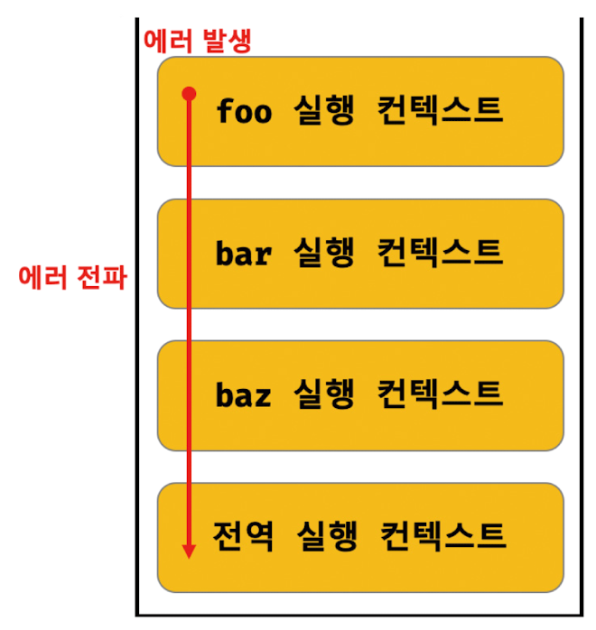

## ✔ 에러처리

<br>

프로그래밍 언어의 오류는 크게 2가지의 종류가 있다.

-프로그램 실행 전에 발생하는 오류 : 구문 오류  
-프로그램 실해 중에 발생하는 오류 : 예외 또는 런타임 오류  

에러가 발생하면 프로그램은 강제 종료된다.

하지만 try catch문을 사용해서 에러에 대처하면 프로그램이 강제 종료되지 않고 계속해서 실행시킬 수 있다.


```js
// 구문오류 예시
console.log('프로그램 시작 !');
// 구문 오류 발생 : 괄호 닫기 x
console.log('프로그램 종료 !'  


// 예외 예시
console.log('프로그램 시작 !');
// 식별자 입력 오류
console.rog('프로그램 종료 !');
```

<br>

예외처리에 사용되는 구문 try catch finally

```js
// 예외처리에 사용되는 구문
try{
    // 예외처리가 필요한 코드
} catch(error) {
    // 예외처리가 발생했을 때 실행될 코드
} finally {
    // 에러가 발생하던 안하던 무조건 실행될 코드
}
```

<br>

## ✔ 예외 객체 

<br>

try catch 구문을 사용하는 경우 catch 의 괄호 안에 입력하는 식별자를 예외 객체이다.  

```js
try {

} catch (error) {

}
```

<br>

Error 생성자 함수가 생성한 에러 객체는 message, stack 프로퍼티를 갖는다.

-massge 프로퍼티는 Error 생성자 함수에 인수로 전달한 에러 메세지이다.  
-stack 프로퍼티 값은 에러를 발생시킨 콜스택의 호출 정보를 나타내는 문자열이며 디버깅 목적으로 사용한다.

<br>

자바스크립트는 Error 생성자 함수를 포함해 7가지의 에러 객체를 생성할 수 있는 Error 생성자 함수를 제공한다.  


<br>

|생성자 함수|인스턴스|
|:---:|:---:|
|Error|일반적인 에러 객체|
|SyntaxError|자바스크립트 문법에 맞지 않는 문을 해석할때 발생하는 에러 객체|
|ReferenceError|참조할 수 없는 식별자를 참조했을 때 발생하는 에러 객체|
|TypeError|피연산자 또는 인수의 데이터 타입이 유효하지 않을 때 발생하는 에러 객체|
|RangeError|숫자값의 허용 범위를 벗어났을 때 발생하는 에러 객체|
|URIError|encodeURI 또는 decodeURI 함수에 부적절한 인수를 전달했을 때 발생하는 에러 객체|
|EvalError|eval 함수에서 발생하는 에러 객체|


<br>


예외 객체의 속성

|속성명|설명|
|:---:|:---:|
|error.name|예외 이름|
|error.message|예외 메세지|

<br>

***

<br>

## ✔ 예외 강제 발생

<br>

개발 과장에서 개발자가 에러를 강제로 발생해야하는 경우가 있다.

```js

try {
    let b = 10 ;
    if(typeof b !== String){ throw new Error('변수의 타입이 String이 아닙니다!') }
} catch (err) {
    console.log(err) // Error: 변수의 타입이 String이 아닙니다! at <anonymous>:3:36
    console.log(err.name); // Error
    console.log(err.message); // 변수의 타입이 String이 아닙니다!
}
```


***

<br>

## ✔ 에러의 전파

<br>

에러는 호출자 방향으로 전파된다.

즉, 콜 스택의 아래 방향 (실행 중인 실행 컨텍스트가 푸시되기 직전에 푸시된 실행 컨텍스트 방향)으로 전파된다.

```js
const foo = () => {
    throw Error('foo 에러 !!') // 4
}

const bar = () => {
    foo(); // 3
}

const baz = () => {
    bar(); // 2
}

try {
    baz(); // 1
} catch (err) {
    console.log(err);
}
```

1에서 baz 함수 호출,  

2에서 bar 함수 호출,

3에서 foo 함수 호출,

4에서 에러 throw

이때 foo 함수가 throw한 에러는 다음과 같이 호출자에게 전파되어 전역에서 캐치된다.

<br>



위 그림처럼 호출자 방향으로 전달되어 catch 된다.

*비동기 함수인 setTimeout이나 프로미스 후속 처리 메서드의 콜백 함수는 호출자가 없다.

위 경우는 태스크 큐나 마이크로태스트 큐에 일시 저장되었다가 콜 스택이 비면 이벤트 루프에 의해 콜 스택으로 푸시되어 실행된다.

이때 콜 스택에 푸시된 콜백 함수의 실행 컨텍스트는 콜 스택의 가장 하부에 존재하게 된다.

따라서 에러를 전파할 호출자가 존재하지 않다.


<br>

***

<br>

에러처리 활용 예시에 대한 참고

[카카오 에러 코드](https://developers.kakao.com/docs/latest/ko/kakaologin/trouble-shooting)

[네이버 api 오류코드](https://developers.naver.com/docs/common/openapiguide/errorcode.md)

[nice pay 에러코드 조회](https://www.nicepay.co.kr/support/code/errorCode.do)

