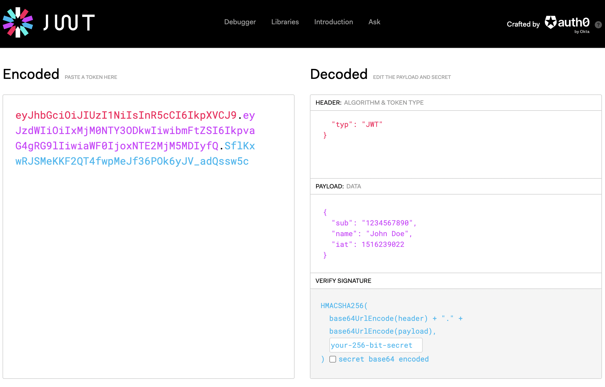

	JWT (Json Web Token)
JWT는 약자 그대로 Json 형식의 웹 토큰을 의미한다.  
공식 홈페이지를 방문해보자  >> [클릭!!](https://jwt.io/)

<br>



<br>
~~아주아주 흉물스럽다 ..~~
우선 인코드된 문자열을 확인해보자 !

<br>

***

<br>

*공식문서에서 확인 할 수 있는 JWT 토큰<span style="color:#fb015b">
eyJhbGciOiJIUzI1NiIsInR5cCI6IkpXVCJ9</span>.<span style="color:#d63aff">eyJzdWIiOiIxMjM0NTY3ODkwIiwibmFtZSI6IkpvaG4gRG9lIiwiaWF0IjoxNTE2MjM5MDIyfQ</span>.<span style="color:#00b9f1">SflKxwRJSMeKKF2QT4fwpMeJf36POk6yJV_adQssw5c</span>

.으로 세 영역을 구분하고 있는데 각각 살펴보자


> <span style="color:#fb015b;font-size:15px;">HEADER:ALGORITHM & TOKEN TYPE</span>.<span style="color:#d63aff;font-size:10px;">~~PAYLOAD:DATA~~</span>.<span style="color:#00b9f1;font-size:10px;">~~VERIFY SIGNATURE~~</span>

<span style="color:#fb015b;">헤더에서는</span> 두 가지의 정보를 가지고 있다.

ALGORITHM : 해시 알고리즘의 정보, 데이터를 암호화 해주는 알고리즘의 정보를 넣어준다.
</br><span style="font-size:12px;">\+추가로 주로 사용하는 알고리즘은 HS256라고들 한다!!</span>


TOKEN TYPE : 토큰의 타입을 지정해준다. 
~~당연하게도 JWT가 들어가 있다~~

```javascript
// 예시 !
{ "alg": "HS256", "typ": "JWT" }
```
위와 같은 정보가 암호화가 되어서 JWT의 HEADER를 구성한다.
 
 </br>

***

</br>

> <span style="color:#fb015b;font-size:10px;">~~HEADER:ALGORITHM & TOKEN TYPE~~</span>.<span style="color:#d63aff;font-size:15px;">PAYLOAD:DATA</span>.<span style="color:#00b9f1;font-size:10px;">~~VERIFY SIGNATURE~~</span>


<span style="color:#d63aff;">payload 에는</span> 토큰에 넣어줄 정보를 가지고 있다.
<span style="font-size:16px;">
  

**Registered claims(등록된 클레임)** : 사전에 이름이 정의 된 클레임이다. 필수 값은 아님!!!
1. <span style="font-size:20px;">iss :</span> 토큰 발급자 (issuer)
2. <span style="font-size:20px;">sub :</span> 토큰 제목 (subject), 토큰의 주제를 설명한다.
3. <span style="font-size:20px;">aud :</span> 토큰 대상자 (audience)
4. <span style="font-size:20px;">exp :</span> 토큰의 만료시간 (expiraton), 숫자 형식으로 유효기간이 지난 토큰은 사용 불가능 하도록 처리한다. 또한 현재 시간보다 이후로 설정되어야한다.
5. <span style="font-size:20px;">nbf :</span> Not Before 를 의미하며, 만료시간과 마찬 가지로 숫자 형식이며, 해당 시간 이전에는 사용라지 않도록 처리 합니다.
6. <span style="font-size:20px;">iat :</span> 토큰이 발급된 시간 (issued at)
7. <span style="font-size:20px;">jti :</span> JWT ID, 주로 중복적인 처리를 방지하기 위하여 사용됩니다
</span>


**공개 (public) 클레임** 
공개용 정보를 위해 사용 된다, 일반적으로 충돌 방지를 위해 URI 형태로 구성된다.

**Private claims(비공개 클레임)**
토큰을 주고 받는 양측에서 사전 협의된 이름으로 사용되는 클레임이다.

</br> 

```javascript
// 예시 !
{
  "sub": "1234567890",
  "name": "John Doe",
  "iat": 1516239022
}
```

</br>

위와 같은 정보가 암호화가 되어서 JWT의 payload를 구성한다.

</br>

***

</br>

> <span style="color:#fb015b;font-size:10px;">~~HEADER:ALGORITHM & TOKEN TYPE~~</span>.<span style="color:#d63aff;font-size:10px;">~~PAYLOAD:DATA~~</span>.<span style="color:#00b9f1;font-size:15px;">VERIFY SIGNATURE</span>

</br>

<span style="color:#00b9f1;">VERIFY SIGNATURE (서명) 에는</span> JWT의 위변조를 검증하기 위한 정보를 가지고 있다.  
인코딩한 Header, Payload 값을 합친 후, 헤더의 alg에서 정의된 알로리즘으로 인코딩하여 생성한다.

</br>

```javacript
//서명을 만드는 슈도코드(pseudocode)의 구조이다.
HMACSHA256(
   base64UrlEncode(header) + "." +
   base64UrlEncode(payload),
   secret
)
```

</br>

***

</br>

## JWT 동작 방식

1. 클라이언트에서 권한을 요청
2. 권한이 부여되면 서버에서 액세스 토큰을 생성 후 반환
3. 클아이언트에 엑세스 토큰을 로컬 쿠키에 저장
4. 클라이언트는 서버에 요청할 때 항상 헤더에 엑세스 토큰을 포함시켜서 요청한다.
5. 요청에 포함된 토큰을 받아서 유효한 토큰인지 secret key를 통해 검증
6. 서버가 클라이언트 측으로 데이터 전달
7. 엑세스 토큰의 수명이 만료되면 토큰을 재발급하여 사용

<br>

***

<br>

## 알아두면 좋은 정보 !!

-JWT는 암호 키를 몰라도 Decode가 가능하다.  
-변조만 불가능 할 뿐, 누구나 복호화하여 보는 것은 가능하다.
-민감한 정보를 담는 것은 권장하지 않는다.  
-특정 언어에서만 사용하는 개념이 아니다.  

<br>

*** 

<br>

## 쿠키, 세션과 어떻게 다른가?

-쿠키/ 세션은 데이터를 교환하려는 방식이지만, JWT는 데이터를 표현하는 형식이다.  
-JWT로 만든 데이터를 브라우저로 보내도 쿠키처럼 자동으로 저장되지는 않다.  
-변조가 거의 불가능하고 서버에서 데이터를 저장하지 않아서 서버를 [Stateless(무상태)](../CS/Stateful_Stateless.md)로 관리할 수 있다는 장점이 있다.  

[\[예제 보러가기\]](./JWT_example.md)