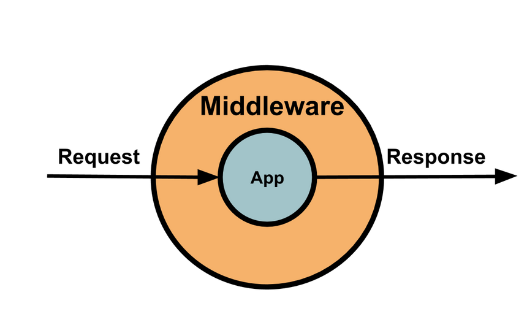

## 미들웨어란 ?

<br>

우선 [공식홈페이지](https://expressjs.com/ko/guide/using-middleware.html)를 통해서 확인해보자


express는 자체적인 최소한의 기능을 갖춘 라우팅 및 **미들웨어** 웹 프레임워크이며, express 애플리케이션은 기본적으로 일련의 미들웨어 함수 호출이라고 설명하고있다.

<br>

#### ~~그래서 미들웨어가 뭔데?~~



미들웨어 함수는 req(요청), res(응답) 그리고 어플리케이션 요청 ~ 응답 과정 도중 그 다음의 미들웨어 함수에 대한 엑세스 권한을 갖는 함수이다.

쉽게 생각하면 클라이언트에게 들어오는 요청을 미들웨어가 받아서 원하는 동작을 하도록 처리해주는 함수라고 할 수 있다.

<br>

***

<br>

### 미들웨어 함수는 어떤 어떤 일을 할까?

<br>

1.모든 코드를 실행  
2.요청 및 응답 객체에 대한 변경을 실행  
3.요청-응답 사이클 종료 (res 호출을 하여 종료 가능)  
4.스택 내의 다음 미들웨어 함수를 호출

<br>

*미들웨어 함수가 요청-응답 사이클을 종료하지 않는 경우에는 next()를 호출하여 그 다음 미들웨어 함수에 제어권을 넘겨야한다.
그렇지 않으면 해당 요청은 정지된 채로 방치된다고 한다.

<br>

***

<br>

Express 애플리케이션은 다음과 같은 유형들의 미들웨어가 있다.

-애플리케이션 레벨 미들웨어  
-라우터 레벨 미들웨어  
-오류처리 레벨 미들웨어  

<br>

***

<br>

## 애플리케이션 레벨 미들웨어

<br>

애플리케이션 레벨 미들웨어는 app.use() 와 app.METHOD() 함수를 사용해서 **애플리케이션 미들웨어를 app 오브젝트 인스턴스에 바인드한다.**

*마운트 경로가 없는 미들웨어 = 앱 요청이 올 때마다 실행된다.

<br>

```js
const app = express();

app.use((req, res, next)=>{
	console.log('요청마다 실행되는 함수입니다.');
	next(); // next() 를 명시해주지 않고 테스트해보면 무한로딩이 된다.
});
```

<br>

*아래 예시는 /path/:id 경로에 대한 모든 유형의 HTTP 요청에 대해 실행된다.

<br>

```js 
// localhost:3000/path/applevel
app.use('/path/:id',(req,res,next)=>{
  console.log(`id값 ${req.params.id}을 가지고 /path 경로로 요청`)
  next();
})

// console
// id값 applevel을 가지고 /path 경로로 요청
```
<br>

*아래 예시는 /path/:id 경로에 대한 GET 요청을 처리한다.

<br>

```js
// localhost:3000/path/applevel?name=kwonga&age=50 
app.get('/path/:id', (req,res,next)=>{
  let {name,age} = req.query;
  console.log(`id값 ${req.params.id}을 가지고 /path 경로로  GET요청`)
  console.log(`GET 요청으로 들어온 데이터 : ${name}, ${age}`);
  next();
})

// console
// id값 applevel을 가지고 /path 경로로  GET요청
// GET 요청으로 들어온 데이터 : kwonga, 50

```

<br>

*아래 예시는 같은 경로의 GET요청에 대해 2개의 라우터를 정의한 예시이다.
(미들웨어의 흐름을 보자)

<br>

```js
// 1번 라우트
app.get('/path/:id', (req, res, next) => {
	console.log('1번 콜백함수 !!');
	next(); // 2번 콜백 함수로 이동
}, (req, res, next) => {
	console.log('2번 콜백함수 !!');
	res.send('함수 종료 !!'); // 요청에 대한 응답을 끝낸다.
  	// res.send 대신 next(); 를 사용하면 2번 라우트도 실행된다.
});

// 2번 라우트 (실행 x -> 1번 라우트에서 사이클을 종료시켜서
app.get('/path/:id', (req, res, next) => {
	console.log('2번 라우트 실행시켜줘 !');
});

// console
// 1번 콜백함수 !!
// 2번 콜백함수 !! 

```

<br>

*아래는 next('route')를 사용하여 흐름을 제어하는 예시이다.  
next('route')를 사용하면 다음 함수를 호출하지 않고 넘어가는 것을 확인할 수 있다.

<br>

```js
// 1번 라우트
app.get('/path/:id', (req, res, next) => {
    if (req.params.id == 0) next('route');
    else next();
}, (req, res, next) => {
    console.log('2번 콜백함수 !!')
    res.send('regular');
});

// 2번 라우트
app.get('/path/:id', (req, res, next) => {
    console.log('2번 라우터 !!');
    res.send('special');
});

// id 값이 0인 경우 : 2번 라우터 !!
// id 값이 0이 아닌 경우 : 2번 콜백함수 !!
```

<br>

***

<br>

## 라우터 레벨 미들웨어

<br>

라우터 레벨 미들웨어는 express.Router() 인스턴스에 바인드 된다는 점을 제외하면 애플리케이션 레벨 미들웨어와 동일한 방식으로 작동된다.

<br>

```js
const app = express();
const router = express.Router();

// 마운트 경로가 없는 미들웨어, 항상 실행된다.
router.use((req, res, next) => {
    console.log('저는 마운트 경로가 없습니다.');
    next();
});

// /path 경로로 들어오는 모든 요청에 대해 항상 실행
router.use('/path/:id', (req, res, next) => {
    console.log('Request URL:', req.originalUrl);
    next();
}, (req, res, next) => {
    console.log('Request Type:', req.method);
    next();
});

// /path 경로로 들어오는 get 요청에 대해 실행
router.get('/path/:id', (req, res, next) => {
    // id 값이 0이면 다음 라우트로
    if (req.params.id == 0) next('route');
    // id 값이 0이 아니면 다음 함수로
    else next(); 
}, (req, res, next) => {
    console.log('end point : regular !!');
    res.send('regular');
});

router.get('/path/:id', (req, res, next) => {
    console.log('end point : special !!');
    res.send('special');
});

app.use('/', router); // /로 들어오는 모든 요청은 reuter로 넘겨주세요


/*id 값이 0인 경우의 콘솔*/
// 저는 마운트 경로가 없습니다.
// Request URL: /path/0
// Request Type: GET
// end point : special !!

/*id 값이 0이 아닌 경우의 콘솔*/
// 저는 마운트 경로가 없습니다.
// Request URL: /path/2
// Request Type: GET
// end point : regular !!

```

<br>

***

<br>

## 오류처리 미들웨어

<br>
오류처리 미들웨어는 일반적인 미들웨어와는 달리 4개의 인수를 제공해야한다.  

그렇지 않으면 일반적인 미들웨어로 해석해서 오류처리에 실패할 수 있다.

<br>

```js
// 오류처리 미들웨어 예시
app.use((err, req, res, next)=>{
	console.log(err);
  	res.status(500).send('500 err !!');
})

```

<br>

단, 오류처리 미들웨어는 다른 app.use() 및 라우트 호출을 정의한 후에 마지막으로 정의해준다.


*아래 예시는 오류처리 미들웨어를 간단하게 정의했다.

<br>

```js
app.get('/',(req,res,next)=>{
	const err = new Error('Not Found');
  	err.status= 404;
  	next(err); // 에러처리 미들웨어 호출, 다음 미들웨어는 실행하지 않고 바로 에러처리 미들웨어를 호출한다
})

// 오류처리 미들웨어
app.use((err, req, res, next) => {
  	console.error(err.stack) // 에러 내용 콘솔 출력
  	res.status(err.status).send('에러!!!!!') 
});

/*
Error: Not Found
at /Users/Desktop/workSpace/expressprog/app.js:73:15
...
*/
```

<br>

next() 함수에는 'route' 문자열을 제외한 다른 내용을 전달하면 express는 오류가 있는 것으로 판단하여 바로 오류처리 미들웨어로 보내준다.

*따로 오류처리 미들웨어를 정의하지 않아도 기본 오류 핸들러가 내장되어있다.

[\[예제 보러가기\]](./Middleware_example.md)